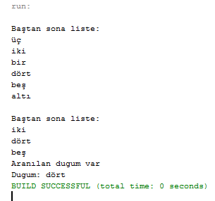

= Çift Yönlü Bağlı Liste

---

Kodlar java dili kullanılarak yazılmıştır.

---
*Fonksiyonlar*

* Baştan Ekleme
* Sondan Ekleme
* Baştan Sil
* Sondan Sil
* İsteneni Sil
* Ara
* Dugume Git

****

*NODE*  //Class1

[source,java]
----
public class Node {
public String bilgi;  <1>
public Node onceki,sonraki;   <2>
public Node(String bilgi)   <3>
{
    this.bilgi=bilgi;
}    
public void yazdir()  <4>
{
    System.out.println(this.bilgi);
}
}
----
<1> Düğümün verisi.
<2> Sonraki ve önceki verilerin adresleri.
<3> Yapılandırıcı.
<4> Veriyi yazdırma.
****

****

*BAĞLANTILI LİSTE* //Class2

[source,java]
----
public class BListe {
public Node head,tail;  <1>
}
----
<1> Baş ve son için düğüm tanımlaması.
****

---
Bu sınıf, fonksiyonları ile devam etmektedir.

---
****

*BAŞA EKLE*

[source,java]
----
public void basaEkle(String bilgi)
{
    Node yeni=new Node(bilgi); <1>
    if(head==null)  <2>
    {
        yeni.sonraki=null;
        yeni.onceki=null;
        head=tail=yeni;
    }
    else <3>
    {
        yeni.onceki=null;
        yeni.sonraki=head;
        head.onceki=yeni;
        head=yeni;
    }
    
}
----
<1> Alınan parametreyi bilgisine atayan yeni adında bir düğüm oluşturur.
<2> Hiç eleman yoksa ilkini oluşturur.
<3> Elemanı başa ekler.
****

****

*SONA EKLE*

[source,java]
----
public void sonaEkle(String bilgi)
{
    Node yeni=new Node(bilgi);  <1>
    if(head==null)  <2>
    {
        yeni.sonraki=null;
        yeni.onceki=null;
        head=tail=yeni;
    }
    else  <3>
    {
        yeni.sonraki=null;
        tail.sonraki=yeni;
        yeni.onceki=tail;
        tail=yeni;
    }
    
}
----
<1> Alınan parametreyi bilgisine atayan yeni adında bir düğüm oluşturur.
<2> Hiç eleman yoksa ilkini oluşturur.
<3> Elemanı sona ekler.

****

****

*BAŞTAN SİL*

[source,java]
----
public void bastanSil()
{
    if(head==null)  <1>
    {
        System.out.println("Liste boş");
        return;
    }
    head=head.sonraki;
    head.onceki=null;  
}
----
<1> Hiç eleman yoksa uyarı verir.
****

****

*SONDAN SİL*

[source,java]
----
public void sondanSil()
{
    if(head==null)  <1>
    {
        System.out.println("Liste boş");
        return;
    }
    tail=tail.onceki;
    tail.sonraki=null;
}
----
<1> Hiç eleman yoksa uyarı verir.
****

****

*İSTENENİ SİL*

[source,java]
----
public void sil(String sil)
{
    Node etkin=head;  <1>
    while(etkin.bilgi!=sil)  <2>
    {
        if(etkin.sonraki==null) <3>
        {
            System.out.println("Silinecek dugum yok.");
            return;
        }
        else 
            etkin=etkin.sonraki;
    }
    if(etkin==head) <4>
    {
        head=head.sonraki;
        head.onceki=null;
    }
    else if(etkin==tail)  <5>
    {
        tail=tail.onceki;
        tail.sonraki=null;
    }
    else <6>
    {
        etkin.onceki.sonraki=etkin.sonraki;
        etkin.sonraki.onceki=etkin.onceki;
    }
}
----
<1> Node tipinde etkin adında arama yapmamızı sağlayacak değişkeni oluşturur.
<2> Silinecek düğümü bulur.
<3> Silinecek düğüm yoksa uyarır.
<4> Silinecek düğüm ilk düğüm ise burada işlem yapar.
<5> Silinecek düğüm son düğüm ise burada işlem yapar.
<6> Silinecek düğüm arada bir düğüm ise burada işlem yapar.
****

****

*ARA*

[source,java]
----
public void ara(String ara)
{
    Node etkin=head;  <1>
    while(etkin.bilgi!=ara)  <2>
    {
        if(etkin.sonraki==null) <3>
        {
            System.out.println("Aranılan dugum yok.");
            return;
        }
        else 
        {
            etkin=etkin.sonraki;  
        }
    }
     System.out.println("Aranılan dugum var");
}
----
<1> Node tipinde etkin adında arama yapmamızı sağlayacak değişkeni oluşturur.
<2> Aranan düğümü bulur.
<3> Aranan düğüm yoksa uyarır.
****

*ARA*

[source,java]
----
public void dugumeGit(int i)
{
    Node etkin=head;  <1>
    while(i>1)  <2>
    {
        if(etkin.sonraki==null) <3>
        {
            System.out.println("Aranılan dugum yok.");
            return;
        }
        else 
        {
            etkin=etkin.sonraki;
            i--;
        }
    }
    System.out.println("Dugum: "+etkin.bilgi);
}
----
<1> Node tipinde etkin adında arama yapmamızı sağlayacak değişkeni oluşturur.
<2> Gidilecek düğümü bulur.
<3> Gidilecek düğüm bulunmuyorsa uyarır.
****

*LİSTELE*

[source,java]
----
 public void listele()
{
    System.out.println();
    System.out.println("Baştan sona liste: ");
    Node etkin = head;  <1>

    while(etkin!=null) <2>
    {
        etkin.yazdir(); <3>
        etkin=etkin.sonraki;
    }
}

----
<1> Node tipinde etkin adında listeyi dolaşmamızı sağlayacak değişkeni oluşturur.
<2> Liste bitene kadar dolaşır.
<3> Düğümün bilgisini yazdıracak fonksiyonu yollar.
****

****

****
